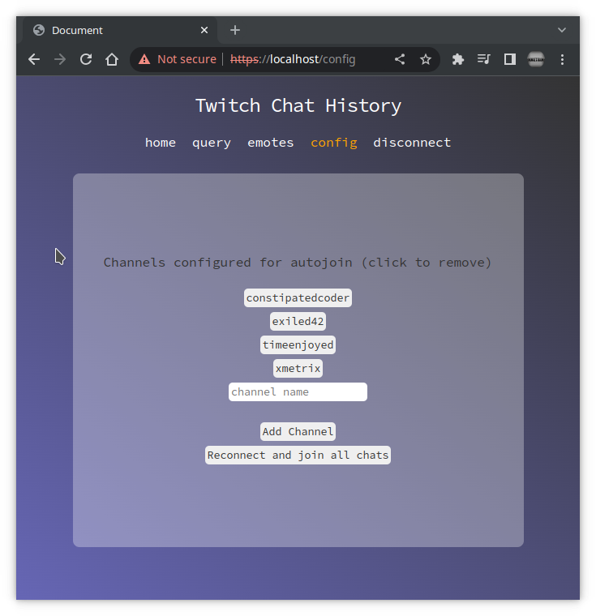

# Twitch Chat History (WIP)




### /Pages/
#### config.php
  - reads from config table, only has channel in the table
  - these are channels to autojoin on connect
  - channels can be added/removed 
#### emotes.php
  - will draw graphs stats info about emotes. 
  - most used emotes
  - total emotes
  - big photo comprised of all the emotes used ? etc.
#### home.php 
  - need to figure out what to do with this page dashboard of some sort?
  - status? chat view?
#### query.php 
  - raw sql query execution (big scary!! no checking no safety... not even implemented yet!)

#### to add pages, simply add page.php in pages folder then create the link in nav.php following the existing structure, finally go to switch statement in index.php and copy one of the other links structure 
---

## /db.php
  - database class that creates $db
    ##### $db
      > database class object
    ##### $db->getChannelsLogged()   
      > SELECT DISTINCT(channel) FROM history
    ##### $db->getHistory($channel)
      > SELECT * FROM history WHERE channel = :channel
    ##### $db->addChannel($channel)
      > INSERT INTO config channel VALUES :channel
    ##### $db->removeChannel($channel)
      > DELETE FROM config WHERE channel = :channel
    ##### $db->getChannels() * can be deleted
      > SELECT channel FROM config
    ##### $db->getConfig()
      > SELECT channel FROM config   
## /functions.php
  - helper functions
    ##### flog($what)
      > file log, logs $what to irc.log
    ##### botPID()
      > gets process id via ps aux | grep "php irc.php"
## /index.php
  - too much to list.
  - nav handles links
  - switch($uri) handles routing
    - routing is configured via nginx conf file
      ```
      server {
        listen 443 ssl;
        listen [::]:443 ssl;
        include snippets/self-signed.conf;
        include snippets/ssl-params.conf;
        server_name localhost;
        root /var/www/html/cj;
        index index.php;
        location / {
          try_files $uri $uri/ /index.php?$args;
        }
        location ~ \.php$ {
          include snippets/fastcgi-php.conf;
          fastcgi_param SCRIPT_FILENAME $document_root$fastcgi_script_name;
          fastcgi_pass unix:/run/php/php7.4-fpm.sock;
        }
      }

        ```

 ## /irc.php
  - the bulk of the work. connects to irc and all configured chats
  - had an ipc socket initially
  - was using ipc socket to send join and part commands
  - ignored all that
#### TODO
  - lots still
  - log emotes as json_encode( something ) 
  - parse and log all chat msgs ( partially parsed )
  - build emote uri for each emote, dl and store as blob

 ## /nav.php
  - handles all the links to the various routes/pages
  - handles toggle of connect/disconnect to launch/kill bot

 ## /style.sass
  - self explanatory
  - has single media query for "mobile"

 ## /UNUSED_socketserver.php
  - thought about creating a multi-user websocket server.. decided against it due to time constraints
  - leaving this incase things change
  
  <br/><br/>

# SQL Database
  ```SQL
  CREATE DATABASE `Twitch` /*!40100 DEFAULT CHARACTER SET utf8mb4 COLLATE utf8mb4_0900_ai_ci */ /*!80016 DEFAULT ENCRYPTION='N' */;
  ```

  ### config
  ```SQL
  CREATE TABLE `config` (
  `channel` varchar(40) NOT NULL,
  PRIMARY KEY (`channel`)
) ENGINE=InnoDB DEFAULT CHARSET=utf8mb4 COLLATE=utf8mb4_0900_ai_ci;
SELECT * FROM Twitch.history;
```

### history
```SQL
CREATE TABLE `history` (
  `id` int NOT NULL AUTO_INCREMENT,
  `author` varchar(50) DEFAULT NULL,
  `timestamp` datetime NOT NULL DEFAULT CURRENT_TIMESTAMP,
  `channel` varchar(45) DEFAULT NULL,
  `message` varchar(500) DEFAULT NULL,
  `emotes` json DEFAULT NULL,
  PRIMARY KEY (`id`)
) ENGINE=InnoDB AUTO_INCREMENT=5 DEFAULT CHARSET=utf8mb4 COLLATE=utf8mb4_0900_ai_ci;
```